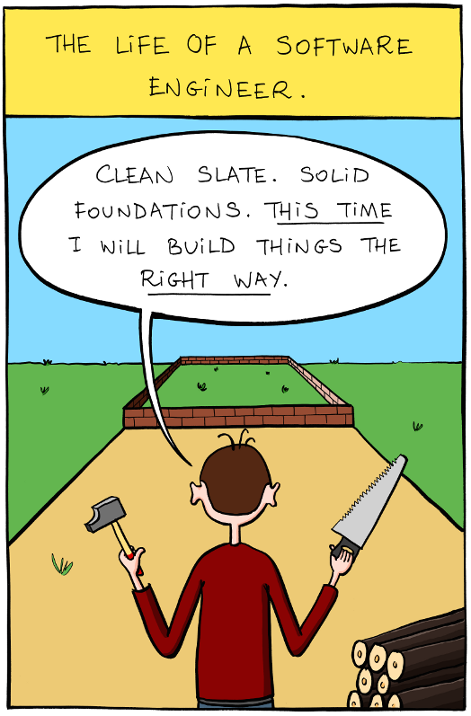
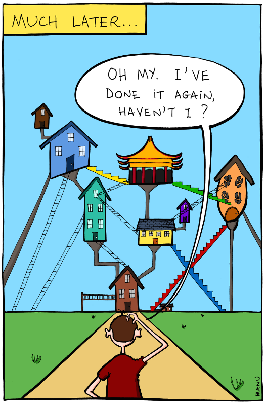

Note:
* We always hope that this time it's going to be different. The previous project taught us so much!

Image credits: http://www.bonkersworld.net/building-software/

^

Note:
* Business ideas are validated by working software:
  > "That didn't work surprisingly. We need to try something else."
  > "We were sure this is going to work on a single page form, but looks like most of the users doesn't fill it in."
* Technical choices are validated by working software:
  > "We didn't expect our users will use search so heavily. We probably need to replace mysql with elastic search."
* Change is inevitable
 * We can try to prevent changes, but it's like working against the business.
 * It's easier to embrace changes, and make them work for us.
 * Even if we had a perfect spec, we'd still get it wrong as we learn during the implementation.

^

Note:
Commiting to decisions made early in the project is the root of all evil.
 * We learn on the project (hopefully) 
 * Beginning of a project is the point in time when we know the least about it.
 * End of a project is when we know the most. Try coding something for a second time.
 * Writing code is not about typing.
You have to finish things - that's what you learn from, you learn by finishing things. Neil Gaiman
Since change is inevitable It's better to embrace it rather than try to fight back. 
Postpone decisions. Defer commitment.

https://sketch.io/sketchpad/
 
^

# Defer commitment

> Decisions are **hard to change** if software components are **tightly coupled**.

Note:
* Rigidity - system is dificult to change
* Fragility - breaks down in unrelated places when a single change is made
* Immobility - parts cannot be easily reused
* Viscosity - hack is easier than doing the right thing
* Needless complexity - dead code, no YAGNI
* Needless repetition - copy&paste
* Opacity - difficult to understand

^

# Defer commitment

> We need **loosely coupled** and **highly cohesive** components to introduce **changes easily**.

