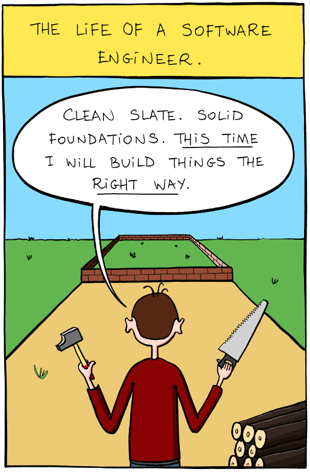
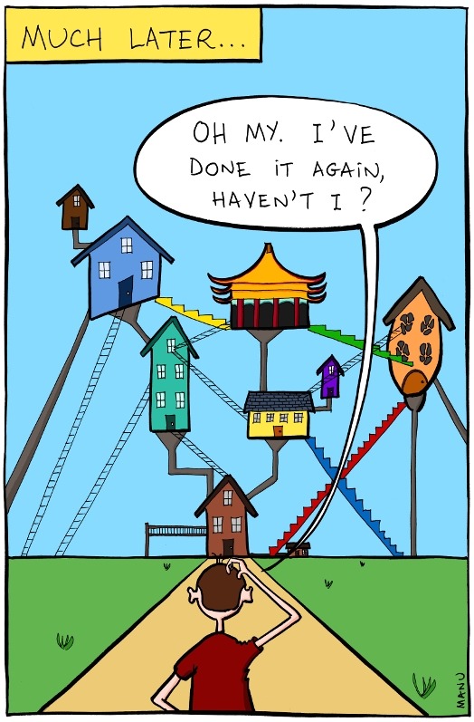

Note:
* We always hope that this time it's going to be different. The previous project taught us so much!

Image credits: http://www.bonkersworld.net/building-software/

^

Note:
* Business ideas are validated by working software:
  > "That didn't work surprisingly. We need to try something else."
  > "We were sure this is going to work on a single page form, but looks like most of the users doesn't fill it in."
* Technical choices are validated by working software:
  > "We didn't expect our users will use search so heavily. We probably need to replace mysql with elastic search."
* Change is inevitable
 * We can try to prevent changes, but it's like working against the business.
 * It's easier to embrace changes, and make them work for us.
 * Even if we had a perfect spec, we'd still get it wrong as we learn during the implementation.

^

Note:
Commiting to decisions made early in the project is the root of all evil.
 * We learn on the project (hopefully) 
 * Beginning of a project is the point in time when we know the least about it.
 * End of a project is when we know the most. Try coding something for a second time.
 * Writing code is not about typing.
Since change is inevitable It's better to embrace it rather than try to fight back. 
Postpone decisions. Defer commitment.

https://sketch.io/sketchpad/
 
^

# Defer commitment

> Decisions are **hard to change** if software components are **tightly coupled**.

Note:
* Rigidity - system is dificult to change
* Fragility - breaks down in unrelated places when a single change is made
* Immobility - parts cannot be easily reused
* Viscosity - hack is easier than doing the right thing
* Needless complexity - dead code, no YAGNI
* Needless repetition - copy&paste
* Opacity - difficult to understand

^

# Defer commitment

> We need **loosely coupled** and **highly cohesive** components to introduce **changes easily**.

