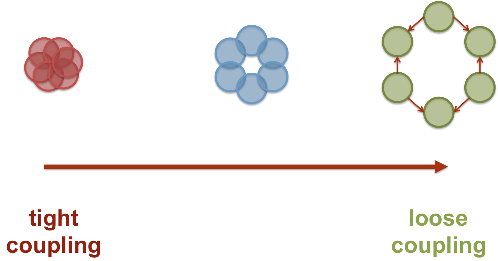
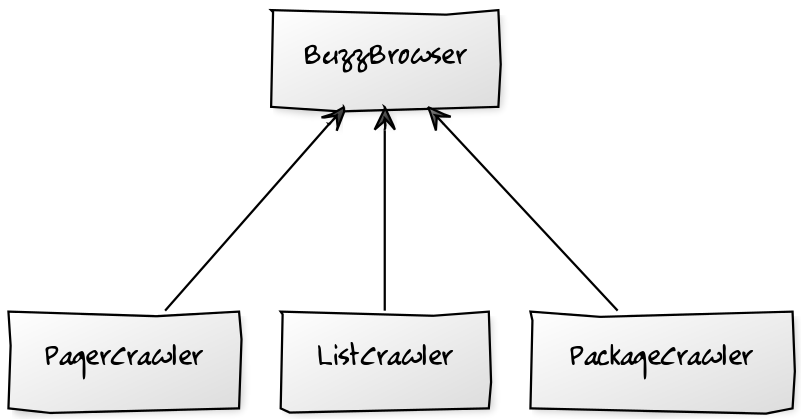
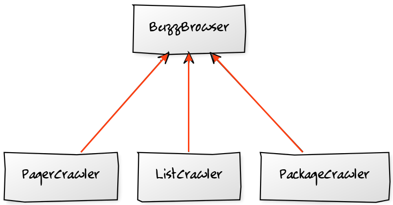
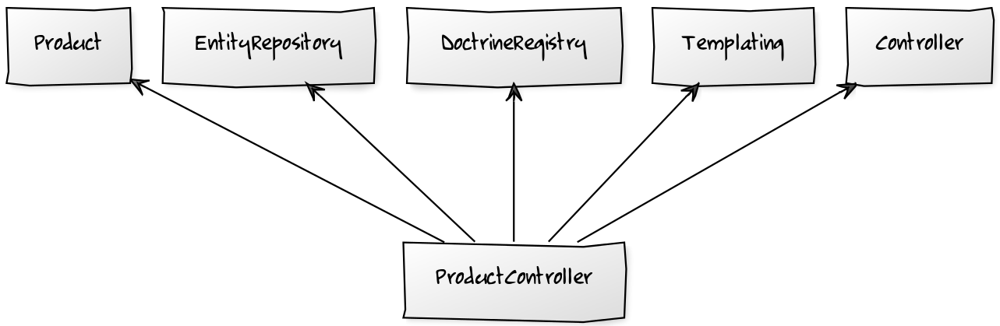

# Coupling & Cohesion

^

# Cohesion

> Cohesion describes how closely are elements in a module related

^

```php
class PackageCrawler
{
    public function crawl()
    {
        $ch = curl_init(); 
        curl_setopt($ch, CURLOPT_URL, 'http://acme.com/'); 
        curl_setopt($ch, CURLOPT_RETURNTRANSFER, 1); 
        $response = curl_exec($ch); 
        curl_close($ch);  
        
        // @todo extract details from the response ...
    }
}
```

Note:
Low cohesion make a module:
* harder to understand
* harder to change
* harder to maintain
* harder to reuse

^

### Single Responsibility Principle

> A module should have one reason to change.

^

### Single Responsibility Principle

> Gather **together** the things that **change** for the **same reasons**.

> **Separate** those things that **change** for **different reasons**.

<small>http://blog.8thlight.com/uncle-bob/2014/05/08/SingleReponsibilityPrinciple.html</small>

^


Note:
* Having several components of low cohesion is a disaster.
* They might be loosely coupled, but contain lots of duplication.
* If we needed to replace curl we'd need to change all the crawlers.

http://yuml.me/edit/8cede4c8

^

# Coupling

> Modules are coupled if changing one of them requires changing another one.

Martin Fowler

<small>http://martinfowler.com/ieeeSoftware/coupling.pdf</small>

^

# Coupling



Note:
* We can't avoid coupling. There's always going to be some degree of coupling between components.
* We aim for loosely coupled components, that talk to each other through well defined interfaces,
  and are easy to replace.

^

### Coupling through a property

```php
use Buzz\Browser;

class Crawler
{
    /**
     * @var Browser
     */
    private $browser;
}
```

^

### Coupling through a method call

```php
class Crawler
{
    private $c;

    public function crawl($url)
    {
        $this->c->getBrowser()->get($url);
    }
}

```

^

### Coupling through a reference

```php
use Buzz\Browser;

class Crawler
{
   public function crawl($url, Browser $b)
   {
       $response = $b->get($url);
   }
}
```

^

### Coupling through a reference

```php
use Buzz\Browser;

class Crawler
{
    /** 
     * @return Browser
     */
    public function crawl($url)
    {
        // ...
        
        return $browser;
    }
}
```

^

### Coupling through an implementation / extension

```php
use Buzz\Browser;

class Crawler extends Browser
{
    public function crawl($url)
    {
        $this->get($url);
    }
}
```

^

### Increasing cohesion

```php
use Buzz\Browser;

class PackageCrawler
{
    private $browser;
    
    public function __construct(Browser $browser)
    {
        $this->browser = $browser;
    }
    
    public function crawl()
    {
        $response = $this->browser->get('/');
        
        // ...
    }
}
```

Note:
* What if you needed to replace the Buzz\Browser?
* Is this the library you want to stay with forever?

^


Note:
http://yuml.me/edit/862c6708

^



Note:
http://yuml.me/edit/8cede4c8

^



^

Count dependencies

```php
class ProductController extends Controller
{
    public function searchAction($keywords)
    {
        $products = $this->get('doctrine')
            ->getRepository('Acme:Product');
            ->search($keywords);
        
        return $this->render(
            'product/search.html.twig',
            ['products' => $products]
        );
    }
}
```

^



