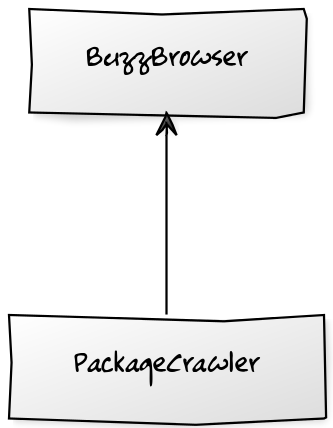
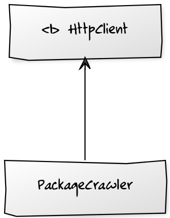
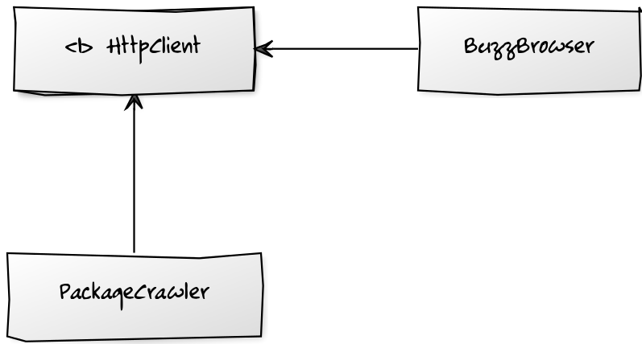
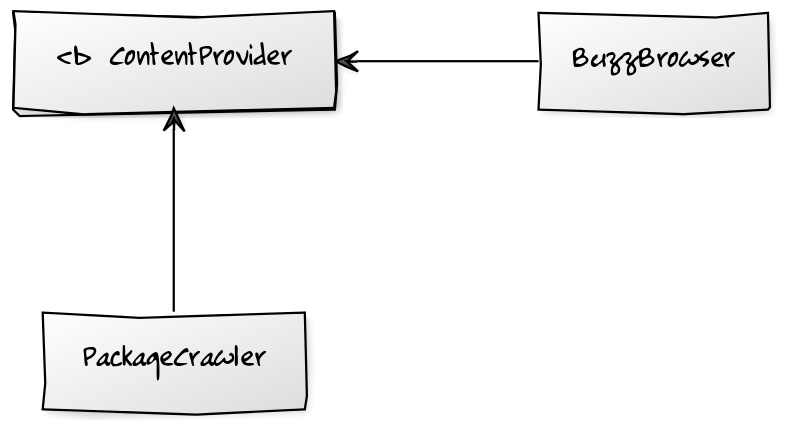
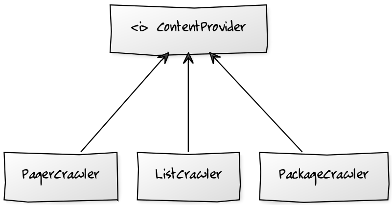
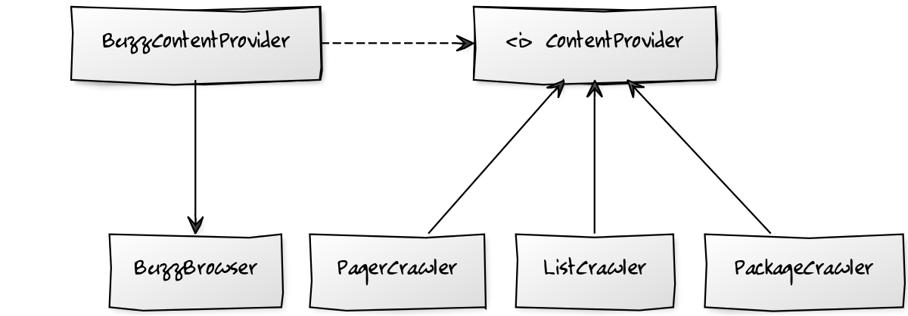
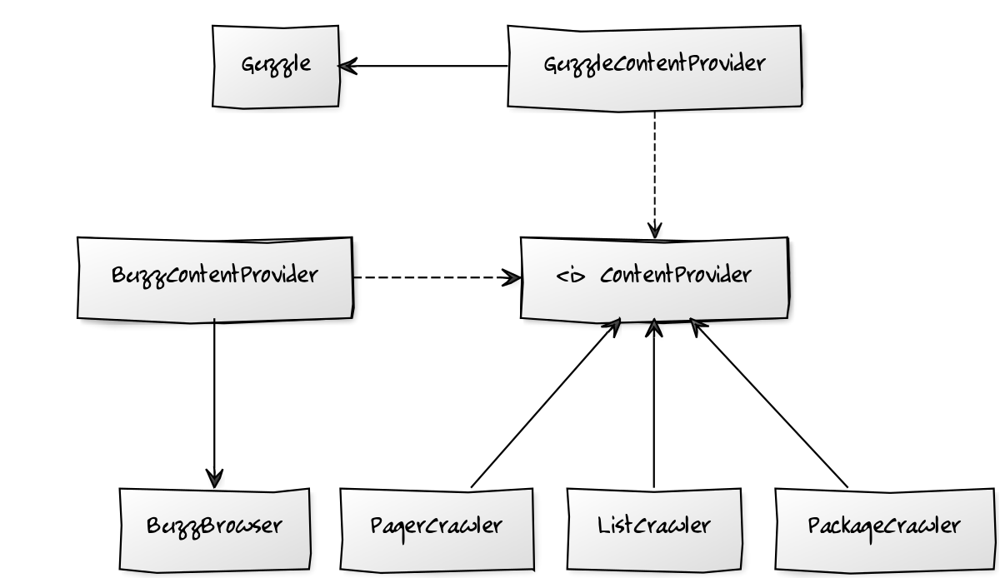

# The Dependency Inversion Principle

^

### High-level modules should not depend on low-level modules. 

```php
use Buzz\Browser;

class PackageCrawler
{
    private $browser;
    
    public function __construct(Browser $browser)
    {
        $this->browser = $browser;
    }
    
    public function crawl($resource)
    {
        $response = $this->browser->get($resource);
        
        // ...
    }
}
```

^

### High-level modules should not depend on low-level modules. 



^

### Both should depend on abstractions. 



Note:
http://yuml.me/edit/f81d34fe

^

### Both should depend on abstractions. 

```php
interface HttpClient
{
    public function get($resource);
}
```

^

### Both should depend on abstractions. 

```php
class PackageCrawler
{
   private $httpClient;

   public function __construct(HttpClient $httpClient)
   {
       $this->httpClient = $httpClient;
   }

   public function crawl()
   {
       $response = $this->httpClient->get('/');

       // @todo parse
   }
}
```

^

### Both should depend on abstractions. 



Note:
http://yuml.me/edit/f81d34fe
http://yuml.me/edit/9158c45e

^

### Both should depend on abstractions. 

```php
use Buzz\Browser;

class BuzzHttpClient implements HttpClient
{
    private $browser;

    public function __construct(Browser $browser)
    {
        $this->browser = $browser;
    }

    public function get($resource)
    {
        return (string) $this->browser->get($resource);
    }
}
```

^

### Abstractions should not depend upon details.


^

### Details should depend upon abstractions.



Note:
http://yuml.me/edit/3dacc9bd
http://yuml.me/edit/567ea1d7

^

```php
interface ContentProvider
{
    public function fetch($resource);
}
```

^

```php
class PackageCrawler
{
   private $contentProvider;

   public function __construct(ContentProvider $provider)
   {
       $this->contentProvider = $provider;
   }

   public function crawl()
   {
       $content = $this->contentProvider->fetch('/');

       // @todo parse
   }
}
```

^

```php
use Buzz\Browser;

class BuzzContentProvider implements ContentProvider
{
    private $browser;

    public function __construct(Browser $browser)
    {
        $this->browser = $browser;
    }

    public function fetch()
    {
        return (string) $this->browser->get('/');
    }
}
```

^



Note:
http://yuml.me/edit/8cede4c8

^



Note:
http://yuml.me/edit/0aa9dc28
http://yuml.me/edit/35376872

^

```php
use Guzzle\Client;

class GuzzleContentProvider implements ContentProvider
{
    private $guzzle;

    public function __construct(Client $guzzle)
    {
        $this->guzzle = $guzzle;
    }

    public function fetch($resource)
    {
        $request = $this->guzzle->createRequest(
            'GET', $resource
        );
        $response = $request->send();

        return $response->getBody();
    }
}
```

^



Note:
http://yuml.me/edit/0581c71e
