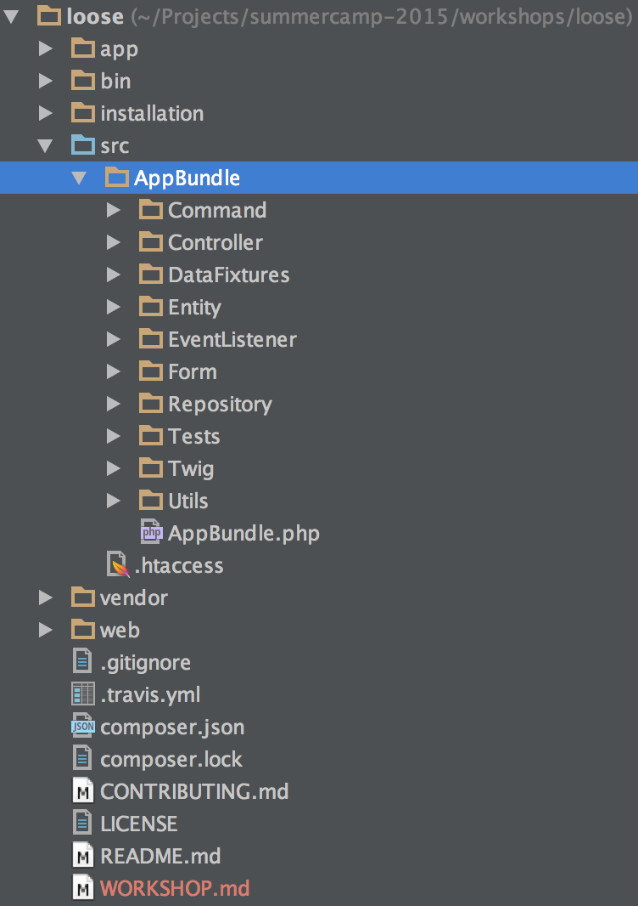
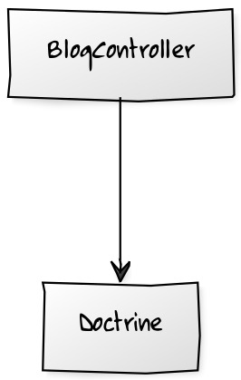
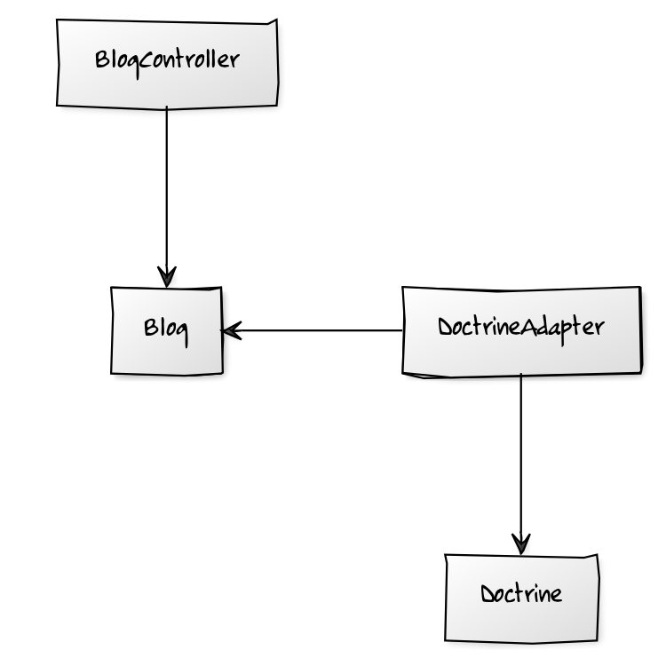

# Symfony Demo

^



https://github.com/symfony/symfony-demo

Note:
* Can you tell me what's thi application about by looking at the high level directory structure?

Remove direct controller/service dependency on doctrine:
1. Register repositories as services
2. Configure the service param converter
3. Introduce a custom user provider
4. Define all the repository methods explicitly

Extract the model
1. Convert the mapping to xml
2. Move entities to the Blog namespace

Extract the repositories
1. Introduce repository interfaces
2. Configure the services to return interfaces
3. Move repository implementations to the infrastructure layer

Provide an alternative implementation
1. Add a new PDO repository implementation to the infrastructure layer

Provide a complementary implementation
1. Add a new Cache implementation to the infrastructure layer

^

**Question**: What is the issue with the following controller?

```php
namespace AppBundle\Controller;

// ... 

/**
 * @Route("/blog")
 */
class BlogController extends Controller
{
    /**
     * @Route("/", name="blog_index")
     */
    public function indexAction()
    {
        $em = $this->getDoctrine()->getManager();
        $posts = $em->getRepository('AppBundle:Post')->findLatest();

        return $this->render(
            'blog/index.html.twig', ['posts' => $posts]
        );
    }
    
    // ...
}
```

Note:
* What if we needed to change the way we retrieve posts to use elastic search?

^



Note:
* diagram: http://yuml.me/edit/bee0d90d

^

# The goal

Decouple from doctrine.

^



Note:
* http://yuml.me/edit/393b7362
* http://yuml.me/edit/78142ddf
* http://yuml.me/edit/8a0d6e83